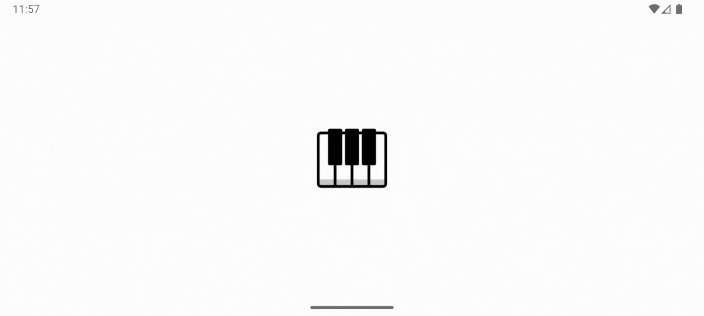

# Piano App

A simple piano application built using Flutter, allowing users to play piano notes on a virtual keyboard.

## Features
- Virtual piano with white and black keys.
- Responsive design for landscape orientation.
- Audio playback for each piano key.

## Screens
- **Splash Screen:** Displays a fade-in "Simple Piano" text before navigating to the home screen.
- **Home Screen:** Contains the piano keys arranged as a traditional keyboard.

> Here's a quick look at the Simple Piano app in action:

<p align="center">
  
</p>

## Getting Started

### Prerequisites
- [Flutter](https://flutter.dev/docs/get-started/install) installed.
- An IDE like [Android Studio](https://developer.android.com/studio) or [Visual Studio Code](https://code.visualstudio.com/).

### Installation
1. Clone the repository:
   ```bash
   git clone https://github.com/SayvIlahsiav/piano_app.git
   ```
2. Navigate to the project directory:
   ```bash
   cd piano_app
   ```
3. Install dependencies:
   ```bash
   flutter pub get
   ```
4. Run the app:
   ```bash
   flutter run
   ```

## Code Overview

### Main Components
- **main.dart:** Sets up the app, enforcing landscape orientation and initializing the app with a splash screen.
- **splash_screen.dart:** Displays a splash screen with a fade-in animation and transitions to the home screen.
- **home_screen.dart:** Builds the main piano interface with white and black keys.
- **piano_key.dart:** Defines individual piano keys, handling the appearance and sound playback.

### Audio Handling
- Uses the `audioplayers` package to play sound files (`.ogg` format) stored in the `assets/sounds` directory.

## Contributing
Contributions are welcome! Please open an issue or submit a pull request with improvements or bug fixes.
